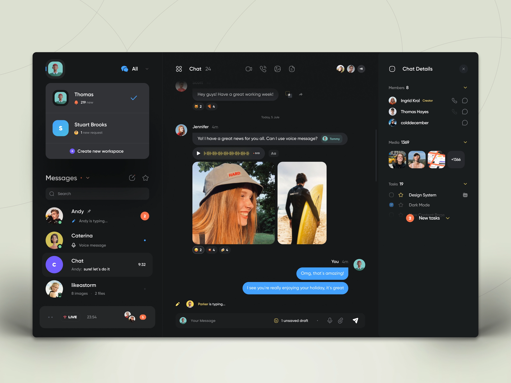

# 💬 Web Chat Clone
  

Made to practice translating design to code, using things like CSS Grid to guide the layout and Styled Components as a CSS-in-JS library.

<h3 align="center">
  <a href="https://web-chat-clone.vercel.app/">Website</a> •
  <a href="https://dribbble.com/shots/16317849-Web-Messenger-UI">Base Design</a>
</h3>

